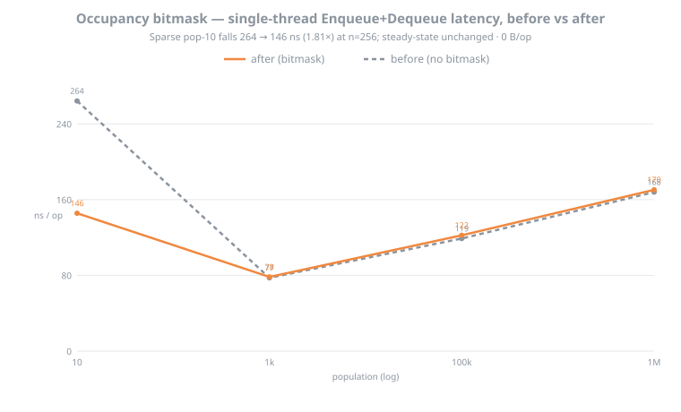
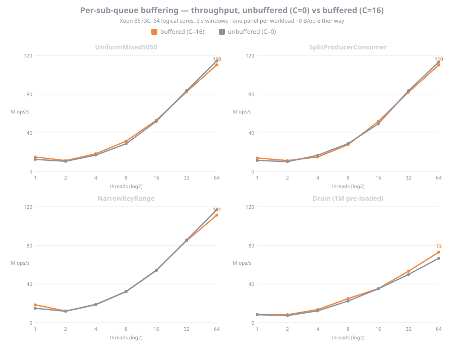
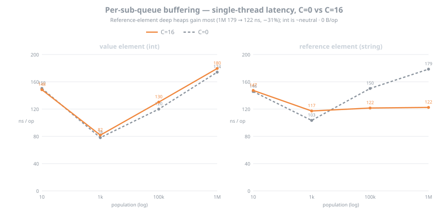
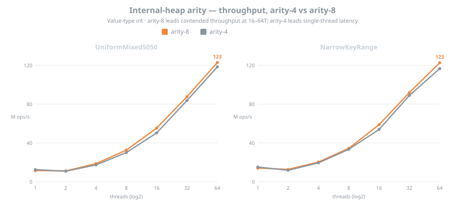

# ConcurrentPriorityQueue — Throughput, Latency, and Stickiness (Xeon 8573C, 64 threads)

**Date:** 2026-06-15

Throughput, single-thread latency, and stickiness measurements for the Bifrost `ConcurrentPriorityQueue` on a 64-thread (32 physical-core) Xeon, plus before/after charts for the occupancy bitmask, per-sub-queue buffering, and internal-heap arity. The relaxed queue is measured against a Naive single-lock priority queue (one global lock around a binary heap) and against its own strict `TryDequeueMin` scan path, across four workloads.

The relaxed queue scales monotonically to about 118 M ops/s at 64 threads while the single-lock baseline stays flat near 5–8 M ops/s, a 12–25× gap. Single-thread latency stays within 1.4–2.2× of a lock-wrapped `PriorityQueue` at zero allocation, and the stickiness knob recovers most of the relaxed queue's deficit in the low-thread regime.

## Environment

| | |
|---|---|
| Host | Azure `Standard_D64s_v6`, eastus2 |
| CPU | Intel Xeon Platinum 8573C, **64 logical / 32 physical cores**, 1 socket, **1 NUMA node** |
| OS | Ubuntu 24.04.4 LTS, x86-64 |
| Runtime | .NET 10.0.9, Release, X64 RyuJIT (AVX-512F+CD+BW+DQ+VL+VBMI) |
| GC | Workstation, Concurrent |
| Throughput harness | fixed-window, 3 s windows, barrier start, 128 B-padded counters |
| Latency / allocation | BenchmarkDotNet 0.14.0, `--job Short` (N=3), `[MemoryDiagnoser]` |
| Sub-queues | `n = RoundUpPow2(4 × 64) = 256`; expected rank error ≈ 212 |
| Raw data | [`data/azure-d64sv6-2026-06-13/`](data/azure-d64sv6-2026-06-13/) |

## Figures

Charts regenerate from the raw CSV with [`generate_charts.py`](data/azure-d64sv6-2026-06-13/generate_charts.py).

**Figure 1 — Scalability across workloads.** Throughput vs thread count, one panel per workload. The relaxed queue scales monotonically to core saturation in every workload; the Naive single-lock baseline peaks at 1 thread and convoys flat once threads contend; the strict `TryDequeueMin` path is the O(n)-scan reference. The relaxed queue reaches 114–118 M ops/s at 64 threads on the mixed and narrow-key workloads and 63 M ops/s on drain, while Naive stays near 5–8.

**Figure 2 — Stickiness ladder.** Throughput vs stickiness `s` at 2 threads, the regime where the relaxed queue's fixed per-op cost weighs most. Reusing sampled sub-queues for `s` consecutive operations (trading rank error for cache locality) lifts throughput monotonically on every workload, for example UniformMixed5050 from 10.6 to 20.2 M ops/s and NarrowKeyRange from 11.4 to 22.0 across `s` = 1 to 8.

**Figure 3 — Stickiness against the Naive baseline at low thread counts.** The same knob drawn against Naive so the gap is visible. At 2 threads (solid) raising `s` lifts the relaxed queue past Naive on every workload: it flips Split and NarrowKey from a slight loss at `s=1` to a ~1.7× win at `s=8`, and widens the UniformMixed and Drain wins to 2.0–2.9×. At 1 thread (dashed) `s` still helps, but an uncontended lock stays ahead, so the single-thread rows remain a loss. The data covers threads 1 and 2 only.

**Figure 4 — Speedup over the Naive single-lock baseline.** Relaxed ÷ Naive on a log axis; above the parity line the relaxed queue wins. Every workload crosses 1× by 4 threads and climbs to 12–25× at 64 threads (Drain 12×, NarrowKey 15×, UniformMixed 16×, Split 25×), the relaxed queue scaling while the single lock convoys.

**Figure 5 — Per-doubling scaling.** Throughput multiplier at each thread-count doubling on UniformMixed5050, against the ideal 2×. The multiplier holds about 1.7× (≈85% efficiency) through 4→32 threads and eases to 1.41× at 32→64. That is a clean near-linear region followed by graceful degradation; the curve stays globally sublinear, bounded by coherence and memory bandwidth.

**Figure 6 — Single-thread latency.** Enqueue+Dequeue pair latency vs population, all paths 0 B/op. Across these steady-state sizes the relaxed queue runs 1.4–2.2× a lock-wrapped `PriorityQueue`, rising with heap depth from 78 ns at 1k to 170 ns at 1M. Population 10 is left off the plot: with 256 sub-queues a 10-element queue is about 96% empty, so each `TryDequeue` falls through to the honest-emptiness scan — the sparse-structure regime (charted in Figure 8), not steady-state latency.

**Figure 7 — The relaxation cost.** Expected dequeue rank error ≈ (5/6)·n with `n = RoundUpPow2(4 × ProcessorCount)` rises with core count. This is the quality price for the scaling in Figures 1 and 4, and the reason `TryDequeue`'s looseness is a property of the hardware rather than a fixed constant. This 64-core host sits at n = 256, rank error about 212.

## Optimization before/after

Each chart toggles one optimization on the same host. Raw data under [`data/azure-d64sv6-2026-06-13/ab/`](data/azure-d64sv6-2026-06-13/ab/).

**Figure 8 — Occupancy bitmask, before vs after.** Single-thread pair latency by population, with and without the sparse-routing occupancy bitmask. The sparse pop-10 case (≈96% empty) drops from 264 to 146 ns (1.81×) once the bitmask routes around the honest-emptiness scan; steady-state populations are unchanged. The win grows with `n`. All 0 B/op.

**Figure 9 — Buffering, C=0 vs C=16.** Throughput per workload, unbuffered against buffered (the ESA §4 optimum `C=16`). Buffering lifts the low-thread regime (+8–23% at 1–8T) and the drain workload at scale (+9.5% at 64T), and is roughly flat on dense mixed at high contention. 0 B/op either way.

**Figure 10 — Buffering, single-thread latency.** Pair latency by population for a value (`int`) and a reference (`string`) element, C=0 vs C=16. Buffering flattens the reference element's deep-heap latency hardest (1M: 179 → 122 ns, −31%), where comparisons and moves are expensive; for cheap `int` it is about neutral. 0 B/op.

**Figure 11 — Internal-heap arity, arity-4 vs arity-8.** Value-type `int` throughput by thread count. arity-8 leads contended throughput at 16–64 threads (+4–10%) — eight `(int,int)` slots fit one 64-byte cache line and the critical section is shorter; arity-4 leads single-thread latency (+2–7%, Figure 6 path). Both 0 B/op; arity-8 passes the concurrency correctness suite.
