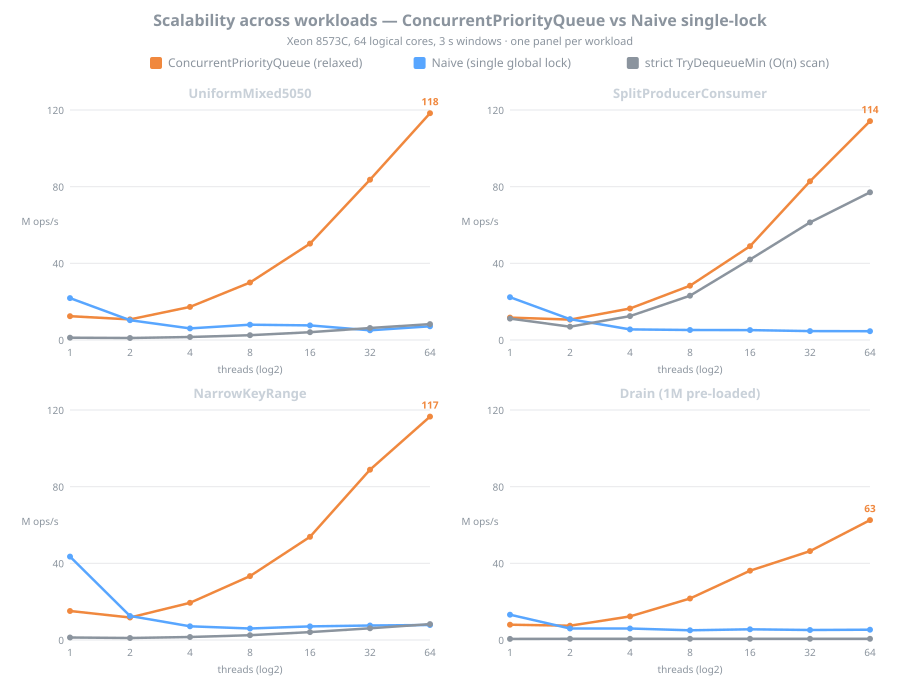
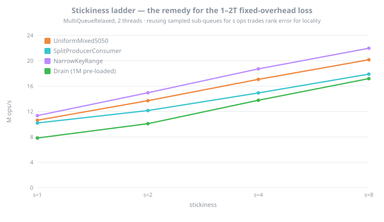
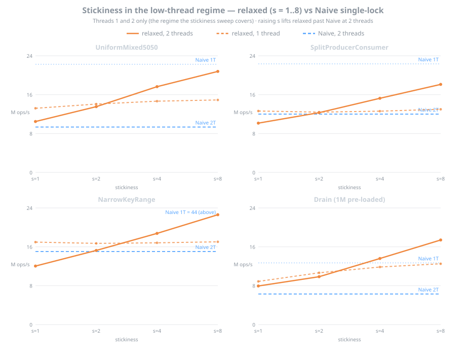
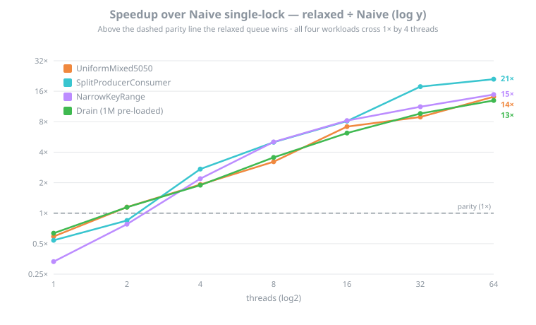
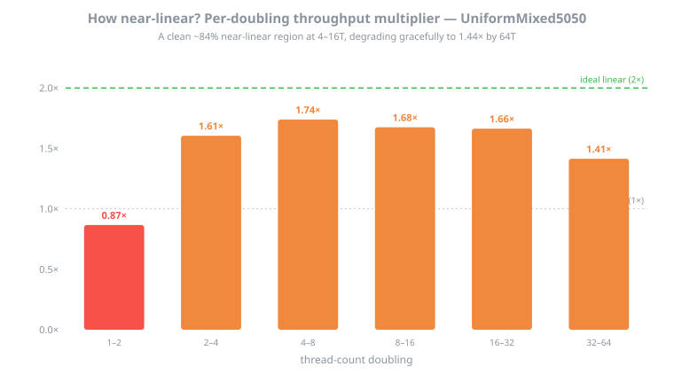
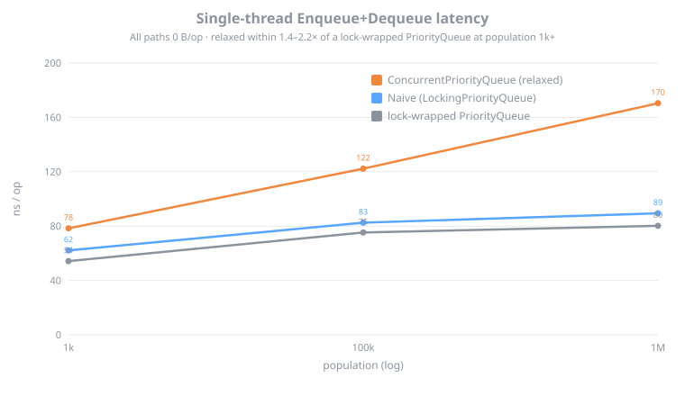
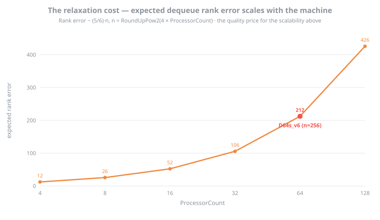

# ConcurrentPriorityQueue — Throughput, Latency, and Stickiness (Xeon 8573C, 64 threads)

**Date:** 2026-06-13

Throughput, single-thread latency, and stickiness measurements for the Bifrost `ConcurrentPriorityQueue` on a 64-core Xeon. The relaxed queue is measured against a Naive single-lock priority queue (one global lock around a binary heap) and against its own strict `TryDequeueMin` scan path, across four workloads.

The relaxed queue scales monotonically to about 114 M ops/s at 64 threads while the single-lock baseline stays flat near 5–9 M ops/s, a 13–21× gap. Single-thread latency stays within 1.4–2.2× of a lock-wrapped `PriorityQueue` at zero allocation, and the stickiness knob recovers most of the relaxed queue's deficit in the low-thread regime.

## Environment

| | |
|---|---|
| Host | Azure `Standard_D64s_v6`, eastus2 |
| CPU | Intel Xeon Platinum 8573C, **64 logical / 32 physical cores**, 1 socket, **1 NUMA node** |
| OS | Ubuntu 24.04.4 LTS, x86-64 |
| Runtime | .NET 10.0.9, Release, X64 RyuJIT (AVX-512F+CD+BW+DQ+VL+VBMI) |
| GC | Workstation, Concurrent |
| Throughput harness | fixed-window, 3 s windows, barrier start, 128 B-padded counters |
| Latency / allocation | BenchmarkDotNet 0.14.0, `--job Short` (N=3), `[MemoryDiagnoser]` |
| Sub-queues | `n = RoundUpPow2(4 × 64) = 256`; expected rank error ≈ 212 |
| Raw data | [`data/azure-d64sv6-2026-06-13/`](data/azure-d64sv6-2026-06-13/) |

## Figures

Charts regenerate from the raw CSV with [`generate_charts.py`](data/azure-d64sv6-2026-06-13/generate_charts.py).

**Figure 1 — Scalability across workloads.** Throughput vs thread count, one panel per workload. The relaxed queue scales monotonically to core saturation in every workload; the Naive single-lock baseline peaks at 1 thread and convoys flat once threads contend; the strict `TryDequeueMin` path is the O(n)-scan reference. The relaxed queue reaches 110–114 M ops/s at 64 threads on the mixed and narrow-key workloads and 66 M ops/s on drain, while Naive stays near 5–9.

**Figure 2 — Stickiness ladder.** Throughput vs stickiness `s` at 2 threads, the regime where the relaxed queue's fixed per-op cost weighs most. Reusing sampled sub-queues for `s` consecutive operations (trading rank error for cache locality) lifts throughput monotonically on every workload, for example UniformMixed5050 from 10.5 to 20.8 M ops/s and NarrowKeyRange from 12.0 to 22.6 across `s` = 1 to 8.

**Figure 3 — Stickiness against the Naive baseline at low thread counts.** The same knob drawn against Naive so the gap is visible. At 2 threads (solid) raising `s` lifts the relaxed queue past Naive on every workload: it flips Split and NarrowKey from a loss at `s=1` to a 1.5× win at `s=8`, and widens the UniformMixed and Drain wins to 2.2–2.8×. At 1 thread (dashed) `s` still helps, but an uncontended lock stays ahead (Naive 1T is the upper blue line), so the single-thread rows remain a loss. The data covers threads 1 and 2 only.

**Figure 4 — Speedup over the Naive single-lock baseline.** Relaxed ÷ Naive on a log axis; above the parity line the relaxed queue wins. Every workload crosses 1× by 4 threads and climbs to 13–21× at 64 threads, the relaxed queue scaling while the single lock convoys.

**Figure 5 — Per-doubling scaling.** Throughput multiplier at each thread-count doubling on UniformMixed5050, against the ideal 2×. The multiplier holds about 1.7× (≈84% efficiency) through 4→16 threads and eases to 1.44× at 32→64. That is a clean near-linear region followed by graceful degradation; the curve stays globally sublinear, bounded by coherence and memory bandwidth.

**Figure 6 — Single-thread latency.** Enqueue+Dequeue pair latency vs population, all paths 0 B/op. Across these steady-state sizes the relaxed queue runs 1.4–2.2× a lock-wrapped `PriorityQueue`, rising with heap depth from 80 ns at 1k to 176 ns at 1M. Population 10 is left off the plot: with 256 sub-queues a 10-element queue is about 96% empty, so each `TryDequeue` falls through to the honest-emptiness scan over all sub-queues and the pair costs ~260 ns — the sparse-structure regime, not steady-state latency (the raw value is in the CSV).

**Figure 7 — The relaxation cost.** Expected dequeue rank error ≈ (5/6)·n with `n = RoundUpPow2(4 × ProcessorCount)` rises with core count. This is the quality price for the scaling in Figures 1 and 4, and the reason `TryDequeue`'s looseness is a property of the hardware rather than a fixed constant. This 64-core host sits at n = 256, rank error about 212.
