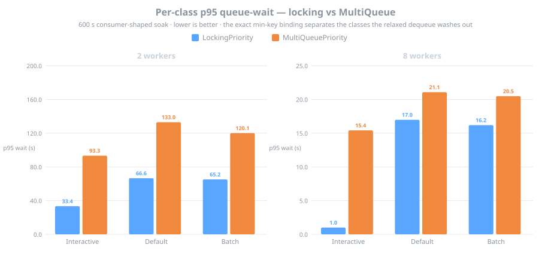
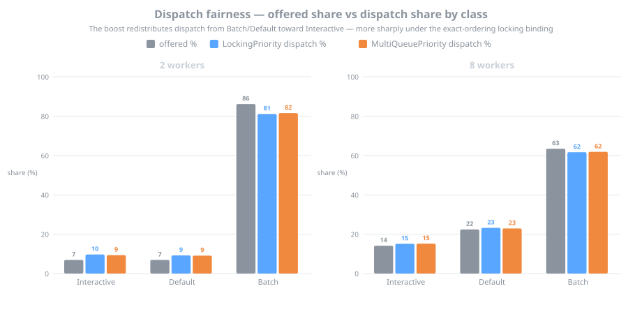
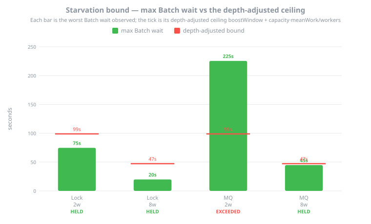

# CPQ Consumer-Shaped Soak (DR-8)

**Date:** 2026-06-15

The consumer-shaped soak is the DR-8 release-gate artifact for the CPQ priority-dispatch port. DataFerry's published results cover contended micro-benchmarks; this measures the regime Bifrost actually runs in — 1–8 workers, seconds-long work items, a barely-contended queue — driving both internal priority bindings (`LockingPriorityWorkQueue` and `ConcurrentPriorityWorkQueue`) through a 600 s mixed-arrival window at workers {2, 8} and recording per-class queue-wait, dispatch fairness, allocation stability, and a starvation probe.

In this regime the exact min-key locking binding wins decisively: at 8 workers it holds interactive p95 queue-wait to 1.0 s against the relaxed MultiQueue's 15.4 s, and it keeps the classes cleanly separated where the MultiQueue's relaxed two-choice dequeue compresses them together. The locking binding holds the DR-5 starvation bound at every worker count; the relaxed MultiQueue, which carries no by-construction ordering guarantee, exceeds it at 2 workers. Both bindings allocate flat with zero collections and shed the lowest class first identically. These are the numbers behind the README's strategy-selection guidance.

## Environment

| | |
|---|---|
| Host | Intel Core i9-13900K, 32 logical / 24 physical cores, Pop!\_OS 24.04 LTS, x86-64 |
| Runtime | .NET 10.0.6, Release, Workstation GC |
| Harness | `soak` CLI verb (`Bifrost.Benchmarks`), 600 s window × 4 runs (both bindings × workers {2, 8}), seed 42 |
| Workload | work items log-uniform 50 ms – 5 s (`Task.Delay`-simulated); arrival mix Interactive 20 % / Default 30 % / Batch 50 %, feedback-steered toward a 40–60 % occupancy band; Batch bursts of 64 every 30 s; capacity 128, watermarks Batch 0.90 / Default 0.95 / Interactive 1.0; boost window 30 s |
| Raw data | [`data/soak-2026-06-15/`](data/soak-2026-06-15/) — `soak-classes.csv`, `soak-runs.csv`, `soak.md` |

## Figures

Charts regenerate from the raw CSV with [`generate_charts.py`](data/soak-2026-06-15/generate_charts.py).

<p align="center"></p>

**Figure 1 — Per-class p95 queue-wait, locking vs MultiQueue.** Lower is better; each panel is scaled to its own regime (2 workers run saturated under the 64-item Batch bursts, 8 workers settle healthy). The exact min-key locking binding holds interactive p95 to 1.0 s at 8 workers against the relaxed MultiQueue's 15.4 s, and keeps Default and Batch visibly behind Interactive where the MultiQueue's two-choice dequeue — with n ≈ 128 sub-queues against a ≤ 128-item queue — compresses the classes together.

<p align="center"></p>

**Figure 2 — Dispatch fairness, offered vs dispatch share.** Both bindings shed the lowest class first — Batch is rejected hardest, Interactive never — and redistribute dispatch share away from Batch toward the Interactive and Default classes, the boost working as intended. The direction is identical on both bindings; the locking binding's exact ordering makes it slightly sharper.

<p align="center"></p>

**Figure 3 — Starvation bound, max Batch wait vs the depth-adjusted ceiling.** The DR-5 bound `boostWindow + capacity·meanWork/workers` holds on the locking binding at both worker counts by construction; the relaxed MultiQueue exceeds it at 2 workers (max Batch wait 225 s against a 99 s ceiling) and clears it only narrowly at 8 — the price of a dequeue that does not honor the virtual-time order exactly. Allocations stayed ≤ 0.17 MiB/min with zero gen 0/1/2 collections on every run.

## Reproduce

```bash
dotnet run -c Release --project src/Bifrost.Benchmarks -- soak --seconds 600 --out soak-results
```

`.github/workflows/soak.yml` runs this on `workflow_dispatch` (with a `seconds` input override) and a nightly cron, uploading `soak-results/` as a build artifact. Per DR-8 the soak is a release-gate/nightly artifact, not a per-PR gate. Single-binding re-runs take `--binding locking|multiqueue`.
