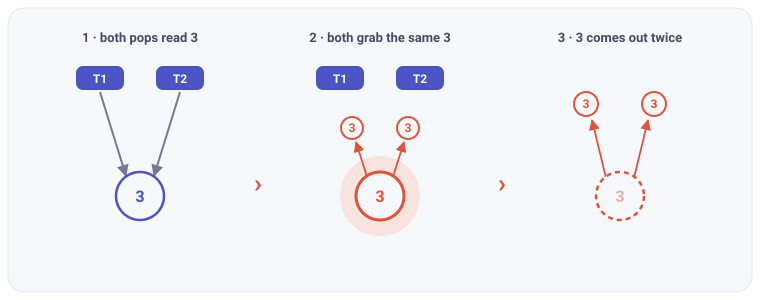

As an unashamed dotnet evangelist, I spend a lot of my time working with the standard collections Microsoft ships in the Base Class Library (BCL). And the BCL's concurrent collections are genuinely excellent: FIFO queues (`ConcurrentQueue`), stacks (`ConcurrentStack`), unordered bags (`ConcurrentBag`), and of course the ubiquitous hash map (`ConcurrentDictionary`).

But what if you want a queue of prioritized elements? Well, there's `PriorityQueue`, but it's not thread-safe, and there's no `ConcurrentPriorityQueue` (CPQ) in the BCL. In fact, almost no major runtime ships one as part of their standard library—the lone exception being Java's `PriorityBlockingQueue` which is literally a lock around a binary heap and thus functionally useless for most concurrent workloads.

This fact struck me as genuinely strange when I stumbled onto it some four years ago. Why aren't there CPQs *anywhere*?! Surely it couldn't be *that* hard to implement, right? Spoiler: It turns out that maintaining strict global order across dozens of threads without relying on a massive, performance-killing lock is an absolute nightmare. Who would've thought?

So began my foray into the wonderfully complicated world of concurrent programming! The result: the first truly scalable concurrent priority queue in dotnet.

---

## What is a priority queue anyway?

A **priority queue** is a collection where every element carries an associated priority, and this priority determines the sequence of execution. High priority elements are served before low priority elements. There are two primary operations in conventional PQs: **insert** an element with a priority, and **delete-min** which pops the current highest priority element.

In practical applications, you find PQs used all over: scheduling, event simulation, graph algorithms, etc, as anybody who's taken a university algorithms class can tell you (did someone say Dijkstra?).

PQs have a lot of interesting properties. Unlike a standard FIFO queue or stack, arrival order *does not matter* and high-priority items added last will still come out first. This sounds like a straightforward principle, but it means you have to keep everything sorted by priority, and maintaining that order is never free: you pay for it in either time or space complexity. For instance, in a sorted Array or List, extracting the highest priority element is instant $O(1)$ time since it's always sitting at the "front". Insertion, however, is quite slow; you have to scan the entire collection to find the right spot, and then shift all subsequent items to make room—resulting in linear $O(n)$ time.

For these reasons, PQs are very typically implemented as binary heaps. In this data structure, the *root* of a heap is always the highest priority item, so we preserve the $O(1)$ time for explicit lookups (peek). Because a binary heap is a tree structure, and it stays perfectly balanced, we know its height is always $\log_2(n)$. Thus, the maximum distance from top to bottom is $\log n$, which nets us $O(\log n)$ insertion time—a significant improvement over an Array or List. This does mean we have to rebalance the collection on delete-min operations, so those degrade to $O(\log n)$ as well. Overall, it's a trade-off well worth making.

## So why is a *concurrent* one so hard?

The promise of a concurrent data structure is straightforward: independent operations can run in parallel, ideally without ever blocking each other. A well-designed one therefore optimizes for *parallelizable* work, keeping operations off the same memory wherever it can. When they do have to touch shared state, that work has to happen in a *linearizable* fashion, and that coordination is almost always a tax on throughput. So the whole craft of designing concurrent data structures comes down to driving the frequency of that coordination toward zero.

Okay, so how is a conventional PQ different from a thread-safe one? Let's try making our original binary heap concurrent: let a couple dozen threads call `insert` and `delete-min` on one shared heap, with no coordination at all. 

*With no coordination, every thread reaches for the same root at once, and the heap corrupts itself almost instantly.*

As you can see, it comes apart almost immediately, because neither operation is atomic. Each one is a multi-step edit to shared state (the underlying array, the `count`, parent-child pointers) and threads interleave right in the middle of those steps. A partial tour of the wreckage:

- Delete-min is a non-atomic read-modify-write on the root, so two threads read the same root before either writes back, and one element is returned twice while the next is lost.
- Insert's sift-up and delete-min's sift-down mutate overlapping nodes with no mutual exclusion, so their swaps interleave and the heap invariant breaks for every operation that follows.
- Reads and writes are never isolated, so a peek can land mid-sift on a node copied but not yet overwritten and hand back a duplicate or a stale value.
- The backing array and `count` are unsynchronized shared state, so two inserts collide on one slot (or a resize swaps the array out mid-write) and writes land in the wrong place or vanish.

Every one of these is a data race, and the standard cure is a synchronization primitive: a **lock**. Wrap each operation in one — acquire, insert or delete-min, release — and the races evaporate, because now exactly one thread is inside the heap at any moment. This is precisely what Java's `PriorityBlockingQueue` does, and what you get by throwing a `lock` around .NET's `PriorityQueue`. And to be clear, it *works*: it's correct, it's simple, and for a handful of threads it's genuinely fine.

It just doesn't scale, and the reason is contention. "One thread at a time" means every other thread that wants in has to stop and wait for the lock. Add more cores and you don't get more throughput — you just grow the line waiting behind it. All the parallelism you started with gets funneled down and squeezed single-file through one narrow opening:

*Every thread's work narrows to a single point of serialization. Add cores and you only lengthen the queue at the neck. The lock is the bottleneck.*

So for the better part of two decades, the state of the art moved off heaps and onto **skiplists**: sorted linked lists with randomized express lanes, and a deep bench of lock-free algorithms to match. Skiplists had one property that looked like the escape hatch — inserts scatter. An element with a random priority splices in at a random spot, so writers rarely collide. A line of increasingly clever designs built genuinely lock-free priority queues on that idea: Lotan–Shavit, Sundell–Tsigas, and Lindén–Jonsson, which shaved delete-min down to roughly a single compare-and-swap.

And they do beat a locked heap, for a while. Push past 8 to 32 cores and they flatten out anyway, because the inserts may scatter but the minimum is always at the *front* of the list, and every `delete-min` still races for that same front. Lindén–Jonsson squeezed it as hard as anyone, with logical deletion and batched unlinking, and still couldn't win: the front of a sorted list is just the heap's root wearing a different outfit. The serial point never moved. That's the lesson the field took a decade to swallow. The bottleneck was never the heap, or the skiplist, or the lock. It's strict ordering itself, and as long as every consumer demands the exact minimum, they're all grabbing for one spot that nothing underneath can spread out.

## 3. Stop asking for *the* smallest

- The move: n small heaps, each its own lock, each publishing its top so any thread can read it without locking.
- Insert → drop into a random heap. Pop → **peek two at random, take the better one.**
- The intuition (the beautiful part): two-choice sampling self-stabilizes — pops chase whichever heap ran ahead, so the tops stay clustered. Power-of-two-choices, same math as balls-in-bins.
- One choice isn't enough — rank error grows unbounded. Two makes it finite. That's the whole trick.
- The price, named: you get *a* smallest, not *the* smallest. Rank error ≈ (5/6)·n. It scales with the *machine* (n ≈ 4×cores), not the workload.
- Credit: this is the **MultiQueue** (Rihani/Sanders/Dementiev '15; Williams et al. '21; exact bound Walzer/Williams '25).
- *→ nice on paper — what does it take to make it a real .NET type?*

## 4. Building it in .NET

- The papers are C++. Porting the idea into a zero-alloc, AOT-safe .NET type is where the real work is.
- Heaps: arity-4, mirroring the BCL `PriorityQueue` layout — familiar, and it makes the lock baseline an apples-to-apples rival.
- Never block: a failed try-lock resamples a different heap instead of waiting. Sizing n to 4×cores guarantees a free heap always exists — expected lock acquisitions per op barely above one.
- Lock-free peek = a seqlock: torn-read safety under a concurrent writer via version stamps + memory barriers. (The arm64 store-store reordering gotcha — good aside.)
- Per-thread xoshiro256\*\* for sampling; power-of-two n turns heap selection into a mask, not a modulo.
- Zero-alloc + AOT, because it's a library others ship: `[InlineArray(16)]` buffers, cache-line padding, devirtualized comparer paths. **0 B/op, value *and* reference elements.**
- Three ESA-2021 optimizations, one line each: **buffering** (touch the deep heap rarely; default-off), **stickiness** (reuse a heap for locality), **occupancy bitmask** (route around empty heaps instead of scanning).
- The strict escape hatch: `TryDequeueMin` scans all n tops in O(n) for the true minimum — in the API precisely because relaxation scales with core count.
- *→ does all this actually beat the lock?*

## 5. The numbers

- Setup line: 64-thread Xeon 8573C, .NET 10, split-workload methodology (built to expose weak relaxed designs), vs. a single global lock around a heap.
- Headline: **monotonic climb to ~118M ops/s @ 64T; the lock is flat at 5–8M from one thread on. 12–25× by 64 threads, parity crossed at just 4.** [Fig 1, 4]
- Scaling quality: ~1.7× per thread-doubling (~85% efficiency) through 32T, easing to 1.4× at 64T — coherence/bandwidth bound, not a defect. [Fig 5]
- The relaxation cost, shown not hidden: rank-error curve vs cores (top ~27 on an 8-core box, top ~213 here). The price for the line above. [Fig 7]
- The honest tax: single-thread 1.4–2.2× a lock-wrapped `PriorityQueue`, 0 B/op → single-threaded code should keep using `PriorityQueue`, and the xmldoc says so. It's a *contention* win. [Fig 6]
- Optimization payoffs, one line each: stickiness 10.6→20.2M ops/s @2T [Fig 2–3]; bitmask 264→146 ns (1.81×) on sparse pops [Fig 8]; buffering −31% on deep reference-type latency but workload-dependent [Fig 9–10]; **arity-8 flips the winner on server silicon** — the surprise [Fig 11].
- *→ so where does this go?*

## 6. Closer — forward-pointing

- One sentence: the only .NET priority queue whose throughput *rises* with your core count.
- It wants to be a BCL proposal — the gap is real, the bar (beat a lock) is cleared.
- CTA: the algorithm walkthrough + open benchmark repo; go read von Geijer's MultiQueue intro for the theory.

---

## Drafting notes

- **Length:** this runs long for one post (~2,500+ words with figures). Natural split point is after §3 — "the idea" as part 1, "the .NET build + numbers" as part 2 — if you want two installments.
- **Figures do the work in §5** — lift them straight from `docs/benchmarks/2026-06-13-cpq-xeon-8573c.md`; each already has a plain-language caption.
- **Citations to weave (footnote style, like the proposal draft):** MultiQueue SPAA'15, Engineering MultiQueues ESA'21, exact rank error ESA'25, power-of-choice PODC'17.
- **Write the headline last** (research consensus); pick it once the opener's on the page.

## Source material

- API framing + demonstrated-need + claim wording: `docs/proposals/draft.md`
- All benchmark numbers and figures: `docs/benchmarks/2026-06-13-cpq-xeon-8573c.md`
- Inspiration (voice/structure): von Geijer, *MultiQueue: The Relaxed Priority Queue* — https://karevongeijer.com/blog/multiqueue-introduction
