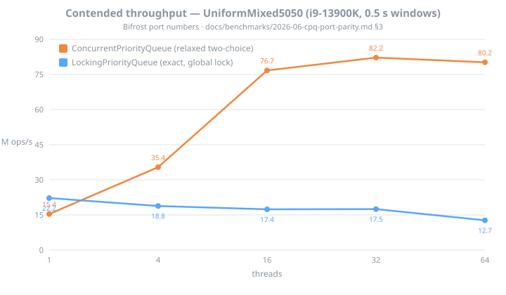
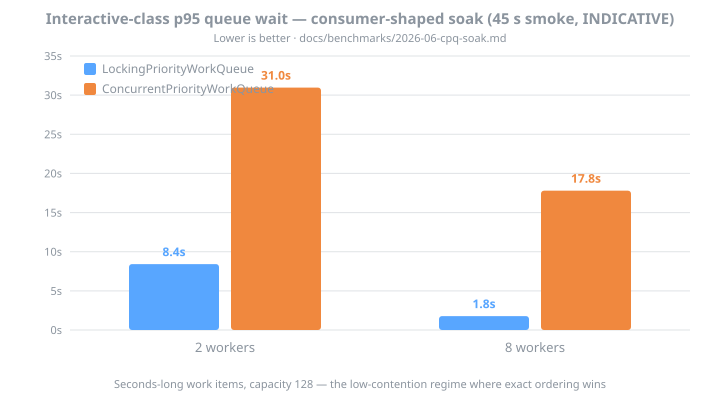

# The Theory Behind Bifrost's Concurrent Priority Queue

*2026-06-13 · companion to the [README's Priority Dispatch guide](../../README.md#priority-dispatch)
and the v0.5.0 CPQ port (issue #17, [design](../designs/2026-06-12-cpq-port-priority-dispatch.md)).*

The README tells you **how** to adopt priority dispatch (instrument on FIFO first, enable on
evidence). This document explains **why the machinery works**: the MultiQueue algorithm behind
`ConcurrentPriorityQueue<TElement, TPriority>`, the relaxation it trades for scalability, the
exact bounds that govern that trade, and how Bifrost's orchestrator layers class-aware
scheduling on top. The animated figures are SMIL SVGs — they play inline on GitHub.

Primary sources: the DataFerry research and design corpus this port descends from
(`DataFerry@2bf0456`: `docs/research/2026-06-09-cpq-v2-theoretical-basis.md`,
`docs/designs/2026-06-09-concurrent-priority-queue-v2.md`,
`docs/designs/2026-06-11-cpq-v2-stickiness.md`,
`docs/api-proposal-concurrent-priority-queue.md`) and the papers in
[References](#references).

---

## 1. Why concurrent priority queues are hard

A priority queue's contract concentrates all contention on one element: every consumer wants
*the* minimum. A single heap behind a lock serializes there; every published strict design —
skiplist-based (Lotan–Shavit, Lindén–Jonsson), array-based (Mounds, CBPQ) — saturates at or
below ~32 threads for the same reason. The head is a sequential bottleneck *by specification*.

The escape hatch is to relax the specification: return *a small* key rather than *the
smallest* key, and quantify exactly how small. That idea has a decade of literature behind it
(SprayList, k-LSM, ZMSQ, Multi Bucket Queues), and one family won on simplicity and measured
quality: the **MultiQueue** (Rihani–Sanders–Dementiev, SPAA 2015; engineered in
Williams–Sanders–Dementiev, ESA 2021; exactly analyzed in Walzer–Williams, ESA 2025).

> No mainstream runtime ships a scalable concurrent priority queue — Java's
> `PriorityBlockingQueue` is still a global lock around a binary heap. The DataFerry project
> built this implementation as a BCL API proposal (`PriorityQueue` was explicitly designed
> non-thread-safe, dotnet/runtime#43957; demand threads back to 2014). Bifrost is its
> shipping home.

## 2. The basic MultiQueue algorithm

Split the one queue into **n = c × ProcessorCount** independent sub-queues (the port uses
**c = 4**, rounded up to a power of two so index selection is a mask, not a division). Each
sub-queue is an *exact* sequential heap behind a try-lock, and publishes its current minimum
to a slot that readers can inspect **without locking**.

- **enqueue**: pick one sub-queue uniformly at random, `TryEnter` its lock, push, unlock. If
  the try-lock fails, *resample a different sub-queue* — never block, never spin on one lock.
- **deleteMin**: peek the published tops of **two** random sub-queues (no locks), `TryEnter`
  the one with the smaller top, re-verify under the lock, pop. On try-lock failure: resample.

The no-waiting discipline gives the structure its progress property, which the source docs
call **wait-free locking**: at most *p* threads can hold locks at once, and there are
*n = 4p* sub-queues, so an unlocked sub-queue always exists and the resample loop terminates
in an expected lock-acquisition count "barely above one." This is a *probabilistic* expected
bound, not classical wait-freedom — but it means no operation ever convoys on a contended
lock, which is precisely the failure mode that caps strict designs.

## 3. Relaxation and rank error — the price, quantified

What you give up is exactness. `TryDequeue` returns an element with *one of* the smallest
priorities — the two sampled tops are the only candidates, and the global minimum may sit in
a sub-queue that wasn't sampled this round.

The damage is measured as **rank error**: how many smaller keys were left behind by a pop.

Three results govern this:

1. **The expected stationary rank error is `(5/6)·n − 1 + 1/(6n)`** for *n* sub-queues —
   an *exact* Markov-chain result (Walzer–Williams, ESA 2025), not an asymptotic estimate.
   With c = 4 that is roughly `3.3 × ProcessorCount`. DataFerry's empirical validation
   matched theory to within ~2.5% (predicted ≈105.7 vs measured 103.1 at p = 64, c = 2).
2. **Two-choice sampling is load-bearing.** With single-choice deletion the rank error grows
   *without bound* (Alistarh–Kopinsky–Li–Nadiradze, PODC 2017); sampling c ≥ 2 candidates
   collapses it to O(p) expected — the same power-of-choice phenomenon that fixes randomized
   load balancing. It cannot be "optimized" away.
3. **The system self-stabilizes.** A skipped minimum isn't lost — it stays at its sub-queue's
   top, and every future two-choice round it survives makes it relatively more attractive.
   Errors do not compound.

Two honesty notes carried over from the source research: the test-suite tail bounds
(`mean ≤ 2·(5/6)·n·s`, `P99 ≤ 10·n·s`) are deliberately generous *engineering gates*, not
theoretical tail bounds — no exact tail distribution is claimed. And most importantly, **the
relaxation scales with the machine, not the workload**: the same binary pops from the
top ≈ 27 on an 8-core box and the top ≈ 213 on a 64-core server. Correctness must never
depend on how close a pop lands to the true minimum — which is exactly why the scheduler
work in #16 (exact-min sleep-until-top semantics) does *not* use this structure, and why the
exact-ordering `LockingPriorityQueue` ships as a supported peer.

## 4. What the port actually carries (V2 engineering)

The ~3.1K-line implementation in `Bifrost.Concurrency` is the DataFerry v2 design, whose
notable departures from the C++ reference implementations are all .NET-motivated:

- **Seqlock-published tops** — the one genuinely novel mechanism vs the reference
  implementation (which requires atomically readable keys). Writers, always under the
  sub-queue lock, bump a version counter to odd, write the top priority and an emptiness
  flag, bump back to even (`Volatile.Write` = release). Readers spin on
  even-version/re-check (`Volatile.Read` = acquire), with bounded retries falling back to
  "unknown — resample elsewhere." This lets `TPriority` be *any* comparable type, not just
  word-sized atomics, with torn reads excluded by the version discipline.
- **Arity-4 implicit heaps with hole-based sift** (one final write per sift instead of swap
  pairs) — chosen over the paper's 8-ary heaps because in a managed runtime every reference
  move pays a GC write barrier; fewer levels × fewer writes wins on .NET.
- **128-byte padding** of each sub-queue's hot header (lock word, published top, stripe
  count) via explicit-layout structs — the only reliable false-sharing tool when the GC can
  relocate objects; 128 B covers Apple/ARM line sizes and Intel adjacent-line prefetch.
- **Per-thread `ThreadHandle` with an inline xoshiro256\*\* RNG** (`[ThreadStatic]`, modeled
  on the thread-pool's own pattern). Thread identity is only ever a *striping hint* —
  correctness survives thread-pool churn and `await` migration.
- **Stickiness s = 1 by default** (the `MQ(c, s)` knob that reuses sampled sub-queues for
  s consecutive ops, multiplying expected rank error to `s·(5/6)·n` in exchange for cache
  locality). At s = 1 the published `(5/6)·n` contract is unchanged.
- **Honest emptiness**: a failed sampled pop only proves two sub-queues were empty, so
  "empty" is reported only after a full verification scan over all n sub-queues — the
  `ConcurrentQueue.TryDequeue` "observed empty at some point during the call" precedent.
  `Count` sums per-stripe counters with snapshot semantics.

## 5. From queue to orchestrator: Bifrost's two scheduling layers

The CPQ orders whatever keys you give it. Bifrost's integration adds the policy: what the
key *means*, and what happens when the queue is nearly full.

### 5.1 The virtual-time priority key

`key = enqueueTicks − classBoost` — a WFQ-style virtual time. Interactive work is boosted by
the window (default 30 s); Batch is not.

The elegance is that the boost window **is** the starvation bound: an item that has waited
longer than the window has a smaller key than *any* fresh arrival of *any* class, so the
maximum overtake is the window itself — by construction, with no aging scans or priority
escalation machinery. (Under the MultiQueue binding this ordering holds in the relaxed,
rank-error sense of §3; under the locking binding it is exact.)

### 5.2 Watermark admission

Priority ordering fixes *who goes first*, not *who gets in* when the bounded queue fills.
Class-aware watermarks shed the lowest class first — and admission is **fail-fast**:

Waiting for space at capacity would hand the priority inversion right back: a queued Batch
backlog would block an Interactive *producer* at the admission boundary. Hence the v0.5.0
breaking change — `EnqueueAsync` returns `ValueTask<EnqueueResult>`, rejections are values
(never exceptions), and they dead-letter with `AttemptCount = 0` for observability.

## 6. What the measurements show

Three committed result sets, three figures (regenerate with
`python3 docs/research/diagrams/generate_charts.py` after updating the source docs):

**Contended throughput** ([port-parity doc](../benchmarks/2026-06-cpq-port-parity.md)) — the
regime the MultiQueue was built for. The relaxed structure climbs monotonically to core
saturation while the exact lock collapses; the port reproduces DataFerry's published curves
on the same host (BDN pair rows within ±4%, 0 B/op preserved).

**Consumer-shaped soak** ([soak doc](../benchmarks/2026-06-cpq-soak.md), 45 s smoke runs —
indicative until the 600 s nightly artifact lands) — the regime Bifrost actually lives in:
1–8 workers, seconds-long work items, ~no queue contention. Here the trade inverts. With
capacity 128 and n ≈ 128 sub-queues on a 32-core host, the expected rank error of §3 is the
same order as the *entire population*, so the MultiQueue's class ordering washes out — while
the global lock, touched once per multi-second work item, never convoys:

This is §3's machine-scaling caveat made visible in a benchmark, and it is why **both**
bindings ship and the README's draft guidance defaults the priority strategy to
`LockingPriorityWorkQueue` for this regime. Each binding's home regime is guarded by its own
benchmark (`throughput` verb for the MultiQueue, the soak for the lock).

**The DR-7 FIFO gate** ([baseline doc](../benchmarks/2026-06-cpq-orchestrator-baseline.md)) —
the port was forbidden from taxing users who never opt in. The first `IWorkQueue` rewrite
failed the gate (~2× latency, async-wrapper boxing); the remediation (pooled-`ValueTask`
forwarding, try-write-first enqueue) restored the deterministic 0 B/op single-worker profile,
with the small residual being the priced-in envelope feature itself:

## 7. Regimes, in one table

| Regime | Winner | Why |
|---|---|---|
| Many workers, micro work items, hot queue | `ConcurrentPriorityQueue` (relaxed) | Contention scatters over n sub-queues; the lock convoys (1.7–17.5× from 4 threads up) |
| 1–2 threads, any work | exact lock | Fixed per-op overhead: ~46 ns (RNG + two seqlock peeks + try-lock + striped count) vs ~32 ns for heap-under-lock |
| Few workers, seconds-long work items (Bifrost's default regime) | `LockingPriorityWorkQueue` | Lock is touched once per multi-second item — can't convoy; exact ordering delivers truthful class separation |
| Narrow key ranges, low thread counts | exact lock | Equal-key sifts terminate early (~26 ns critical sections) |
| Exact-min semantics required (e.g. #16 scheduler sleep-until-top) | `LockingPriorityQueue` / sequential `PriorityQueue` | Relaxed pops are *contractually* allowed to skip the minimum |

## References

**Papers** (as cited by the source research corpus):

1. Rihani, Sanders, Dementiev. *Brief Announcement: MultiQueues: Simple Relaxed Concurrent Priority Queues.* SPAA 2015. arXiv:1411.1209
2. Williams, Sanders, Dementiev. *Engineering MultiQueues: Fast Relaxed Concurrent Priority Queues.* ESA 2021, LIPIcs 204. arXiv:2107.01350 (journal extension arXiv:2504.11652)
3. Walzer, Williams. *A Simple yet Exact Analysis of the MultiQueue.* ESA 2025, LIPIcs 351. arXiv:2410.08714 — source of the exact `(5/6)·n − 1 + 1/(6n)` stationary rank error
4. Alistarh, Kopinsky, Li, Nadiradze. *The Power of Choice in Priority Scheduling.* PODC 2017. arXiv:1706.04178 — single-choice unboundedness; O(p) two-choice bound
5. Postnikova, Koval, Nadiradze, Alistarh. *Multi-Queues Can Be State-of-the-Art Priority Schedulers.* PPoPP 2022. arXiv:2109.00657
6. Alistarh, Kopinsky, Li, Shavit. *The SprayList: A Scalable Relaxed Priority Queue.* PPoPP 2015
7. Wimmer, Gruber, Träff, Tsigas. *The Lock-free k-LSM Relaxed Priority Queue.* PPoPP 2015. arXiv:1503.05698
8. Gruber, Träff, Wimmer. *Benchmarking Concurrent Priority Queues.* arXiv:1603.05047 — the split-workload cautionary tale behind the benchmark hygiene rules
9. von Geijer, Tsigas. *How to Relax Instantly: Elastic Relaxation of Concurrent Data Structures.* Euro-Par 2024 (Best Paper); IEEE TPDS 36(12), 2025

(Strict-design context: Lotan–Shavit IPDPS 2000; Lindén–Jonsson OPODIS 2013; Liu–Spear ICPP
2012 (Mounds); Braginsky–Cohen–Petrank Euro-Par 2016 (CBPQ); Sagonas–Winblad LCPC 2016;
Rukundo–Tsigas Euro-Par 2021 (TSLQueue); Grimes et al. DISC 2025 (PIPQ); Zhou–Michael–Spear
ICPP 2019 (ZMSQ); Zhang–Posluns–Jeffrey SPAA 2024 (Multi Bucket Queues).)

**Pedagogy**: the animated-figure approach follows Kåre von Geijer's
[MultiQueue introduction](https://karevongeijer.com/blog/multiqueue-introduction/), a
recommended companion read.

**Source corpus** (DataFerry, frozen at `2bf0456` as the BCL-proposal showcase):
`docs/research/2026-06-09-cpq-v2-theoretical-basis.md` ·
`docs/designs/2026-06-09-concurrent-priority-queue-v2.md` ·
`docs/designs/2026-06-11-cpq-v2-stickiness.md` ·
`docs/api-proposal-concurrent-priority-queue.md`
