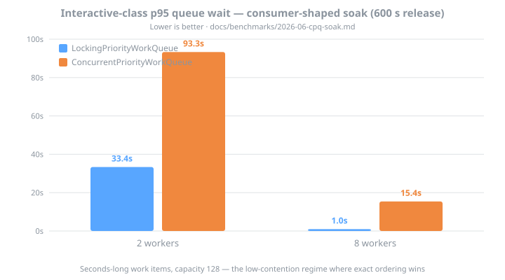
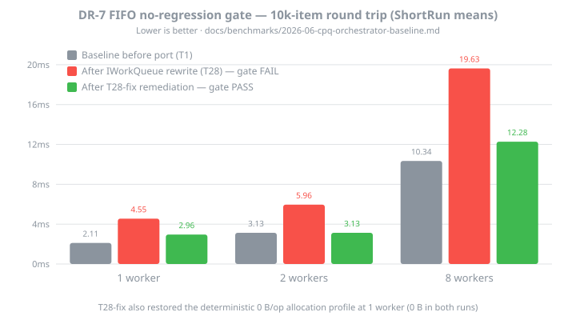

# Background: the MultiQueue inside Bifrost.Concurrency

The [README's priority-dispatch guide](../../README.md#priority-dispatch) covers the *how*: instrument on FIFO first, enable priority dispatch when the numbers say so. This file covers the *why*. What the data structure actually is, what it trades away, the bounds that govern the trade, and how the orchestrator builds class-aware scheduling on top of it. The figures are animated SVGs and play inline on GitHub; each loops every 10–14 seconds.

Everything here is distilled from the research corpus this port descends from (the DataFerry repo, frozen at `2bf0456`: `docs/research/2026-06-09-cpq-v2-theoretical-basis.md`, the v2 and stickiness design docs, and the BCL API proposal) plus the papers in [References](#references).

## Why a concurrent priority queue is hard

A priority queue concentrates all contention on a single element, because every consumer wants the same thing: the minimum. Put one heap behind one lock and that lock is your ceiling. Go lock-free and the head is still your ceiling, just with more exotic failure modes. Every published strict design, from the Lotan–Shavit skiplist through Mounds and CBPQ, saturates at or below roughly 32 threads, and not for lack of engineering effort. The head is a serial point *by specification*.

What actually moves the ceiling is changing the specification: return *a* small key instead of *the* smallest key, and state precisely how wrong you are allowed to be. Relaxed designs spent a decade exploring that trade (SprayList, k-LSM, ZMSQ, Multi Bucket Queues). The MultiQueue won it on simplicity and measured ordering quality, and it has unusually solid theory behind it for something this easy to describe (Rihani–Sanders–Dementiev, SPAA 2015; the ESA 2021 engineering paper; an exact analysis at ESA 2025).

Worth knowing for context: no mainstream runtime ships a scalable concurrent priority queue. Java's `PriorityBlockingQueue` is a global lock around a binary heap and has been for twenty years. .NET's `PriorityQueue` was designed non-thread-safe on purpose (dotnet/runtime#43957), and requests for a concurrent one go back to 2014. DataFerry built this implementation as a BCL API proposal; Bifrost is where it ships.

## The algorithm, in one figure

Split the queue into **n = 4 × ProcessorCount** sub-queues (rounded up to a power of two, so picking one is a bit-mask, not a division). Each sub-queue is a perfectly ordinary *exact* heap guarded by a try-lock, and it publishes its current minimum to a slot that anyone may read without locking.

Both operations follow the same discipline:

- enqueue picks one sub-queue uniformly at random, try-locks it, inserts, unlocks. If the try-lock fails it does not wait; it picks a different sub-queue and tries again.
- deleteMin reads the published tops of *two* random sub-queues, taking no locks at all, then try-locks whichever showed the smaller key, re-checks under the lock, and pops. Failed try-lock, same rule: resample.

That no-waiting rule is where the progress guarantee comes from. At most *p* threads can hold locks at any instant and there are *4p* sub-queues, so an unlocked one always exists, and the expected number of lock acquisitions per operation is barely above one. The source docs call this "wait-free locking". It is a probabilistic expected bound rather than classical wait-freedom, but the practical content is real: nothing ever convoys on a contended lock, which is exactly the disease that kills strict designs.

## Rank error: the price, with a number on it

The contract is strange the first time you meet it. `TryDequeue` returns an element with *one of* the smallest priorities, and it is allowed to miss the actual minimum, because only two sub-queue tops were ever candidates. The miss is measured as **rank error**: how many smaller keys got left behind.

The number attached to the contract is exact, not asymptotic: the expected stationary rank error is **(5/6)·n − 1 + 1/(6n)** for n sub-queues, from a Markov-chain analysis by Walzer and Williams (ESA 2025). With the c = 4 multiplier that works out to roughly 3.3 × ProcessorCount. DataFerry validated it empirically and landed within about 2.5% of theory (predicted ≈105.7, measured 103.1, at p = 64 with c = 2).

Two more things the theory says, both load-bearing. First, the two-choice sample is not an optimization target: with single-choice deletion the rank error grows *without bound* (Alistarh et al., PODC 2017), so sampling two tops is the whole ballgame, the same power-of-choice effect that fixes randomized load balancing. Second, the system self-stabilizes. A skipped minimum is not lost; it sits at its sub-queue's top looking more and more attractive every round, so errors do not compound.

Two honesty notes carried straight from the source research. The repo's test-suite tail bounds (mean ≤ 2·(5/6)·n·s, P99 ≤ 10·n·s) are deliberately generous engineering gates, not theorems; nobody has published an exact tail distribution. And the relaxation scales with the *machine*, not the workload. The same binary pops from roughly the top 27 on an 8-core box and from the top 213 on a 64-core server. Correctness must never depend on how close a pop lands to the true minimum. That single sentence is why the #16 scheduler (which needs exact sleep-until-top semantics) does not use this structure, and why the exact-ordering `LockingPriorityQueue` ships beside it as a fully supported peer rather than a test fixture.

## What the .NET implementation does differently

The port is the DataFerry v2 design, about 3.1K lines under `MultiQueue/`. Where it departs from the C++ reference implementations, the reason is always the managed runtime:

- The seqlock-published top has no counterpart in the C++ reference implementations, which require atomically readable keys and so restrict priorities to word-sized types. Writers (always under the sub-queue lock) bump a version counter to odd, write the priority plus an emptiness flag, and bump back to even. Readers spin on even-and-unchanged with a handful of retries, then give up and resample another queue. `Volatile.Write` release on the writer side and `Volatile.Read` acquire on the reader side make the even-version check sufficient to exclude torn reads. If you only read one part of the source, read this one (`SubQueueHeader.cs`).
- Heaps are arity-4 with hole-based sift, one final write instead of swap pairs, rather than the paper's arity-8. On .NET every reference move pays a GC write barrier, so fewer levels times fewer writes wins.
- Every sub-queue's hot header (lock word, published top, stripe count) is padded to 128-byte boundaries with explicit-layout structs, the only reliable false-sharing tool when a compacting GC can relocate objects. 128 covers both Apple/ARM line sizes and Intel's adjacent-line prefetch.
- Per-thread state is a `[ThreadStatic]` handle carrying an inline xoshiro256\*\* generator, modeled on the thread pool's own internals. Thread identity is only ever a striping hint. Stale state is harmless, so the structure survives thread-pool churn and work migrating across `await`.
- Stickiness (the MQ(c, s) knob that reuses sampled sub-queues for s consecutive operations, trading rank error of s·(5/6)·n for cache locality) ships defaulted to s = 1, which keeps the published contract bit-identical.
- Emptiness is reported honestly. A failed sampled pop only proves two sub-queues were empty, so `TryDequeue` returns false only after a full verification scan over all n sub-queues, the same "observed empty at some point during the call" wording `ConcurrentQueue` uses. `Count` sums striped counters with snapshot semantics.

## How Bifrost turns the queue into a scheduler

The CPQ orders whatever keys it is given. The orchestrator's contribution is policy: what a key means, and what happens at the door when the queue is nearly full.

### The virtual-time key

`key = enqueueTicks − classBoost`. Interactive work gets boosted by the window (30 s by default); Batch gets nothing.

I find this construction genuinely satisfying: the boost window *is* the starvation bound. An item that has waited longer than the window carries a smaller key than any fresh arrival of any class, so the worst-case overtake equals the window, full stop. No aging scans, no escalation timers, no bookkeeping that can fall behind. Under the MultiQueue binding the ordering holds in the relaxed, rank-error sense above; under the locking binding it is exact.

### Watermark admission

Ordering decides who goes first. Watermarks decide who gets in when the bounded queue fills, and they shed the cheapest class first.

Admission is fail-fast on purpose. Waiting for space at capacity would hand the priority inversion right back, because a queued Batch backlog would then block an Interactive *producer* at the door. That reasoning is the root of the v0.5.0 breaking change: `EnqueueAsync` returns `ValueTask<EnqueueResult>`, a rejection is a value rather than an exception, and it dead-letters with `AttemptCount = 0` so the shed is visible in telemetry.

## What the benchmarks say

Three committed result sets back the claims above. The charts regenerate from the result docs with `python3 src/Bifrost.Concurrency/diagrams/generate_charts.py`.

Contended throughput first, the regime the MultiQueue exists for. The relaxed structure climbs to core saturation while the exact lock collapses, and the port reproduces DataFerry's published curves on the same physical machine (BDN pair rows within ±4%, 0 B/op preserved). Details in the [port-parity doc](../../docs/benchmarks/2026-06-cpq-port-parity.md).

Then the [consumer-shaped soak](../../docs/benchmarks/2026-06-cpq-soak.md), which is the regime Bifrost actually runs in: a handful of workers, seconds-long work items, a queue that is barely contended. Here the trade inverts, and it inverts for exactly the reason §3 predicts. With capacity 128 and n ≈ 128 sub-queues on a 32-core host, the expected rank error is the same order as the entire population, so the MultiQueue's class ordering washes out, while a global lock touched once per multi-second work item never convoys. These are the 600 s release-soak numbers, and the gap is not subtle:

This is why both bindings ship and why the README's guidance defaults the priority strategy to `LockingPriorityWorkQueue`. Each binding's home regime is guarded by its own benchmark, so neither can quietly regress.

Finally the [DR-7 FIFO gate](../../docs/benchmarks/2026-06-cpq-orchestrator-baseline.md), which enforced that users who never opt into priority dispatch pay nothing for the port. The first `IWorkQueue` rewrite failed it, roughly 2× latency from async-wrapper boxing. The remediation (forwarding the channel's pooled `ValueTask` directly, plus a try-write-first enqueue) restored the deterministic 0 B/op single-worker profile; what remains is the priced-in cost of the envelope feature itself.

## Which queue, when

| Regime | Use | Why |
|---|---|---|
| Many workers, micro work items, hot queue | `ConcurrentPriorityQueue` | Contention scatters across n sub-queues; the lock convoys (1.7–17.5× from 4 threads up) |
| 1–2 threads | the exact lock | Fixed per-op cost: ~46 ns of RNG + two seqlock peeks + try-lock, versus ~32 ns for heap-under-lock |
| Few workers, seconds-long items (Bifrost's default regime) | `LockingPriorityWorkQueue` | The lock is touched once per multi-second item and cannot convoy; exact ordering gives truthful class separation |
| Narrow key ranges at low thread counts | the exact lock | Equal-key sifts terminate early; the baseline's critical section drops to ~26 ns |
| Exact-min semantics required (the #16 scheduler) | `LockingPriorityQueue` or plain `PriorityQueue` | A relaxed pop is contractually allowed to miss the minimum |

## References

1. Rihani, Sanders, Dementiev. *Brief Announcement: MultiQueues: Simple Relaxed Concurrent Priority Queues.* SPAA 2015. arXiv:1411.1209
2. Williams, Sanders, Dementiev. *Engineering MultiQueues: Fast Relaxed Concurrent Priority Queues.* ESA 2021, LIPIcs 204. arXiv:2107.01350 (journal extension arXiv:2504.11652)
3. Walzer, Williams. *A Simple yet Exact Analysis of the MultiQueue.* ESA 2025, LIPIcs 351. arXiv:2410.08714. Source of the exact stationary rank error
4. Alistarh, Kopinsky, Li, Nadiradze. *The Power of Choice in Priority Scheduling.* PODC 2017. arXiv:1706.04178. Single-choice unboundedness; the O(p) two-choice bound
5. Postnikova, Koval, Nadiradze, Alistarh. *Multi-Queues Can Be State-of-the-Art Priority Schedulers.* PPoPP 2022. arXiv:2109.00657
6. Alistarh, Kopinsky, Li, Shavit. *The SprayList: A Scalable Relaxed Priority Queue.* PPoPP 2015
7. Wimmer, Gruber, Träff, Tsigas. *The Lock-free k-LSM Relaxed Priority Queue.* PPoPP 2015. arXiv:1503.05698
8. Gruber, Träff, Wimmer. *Benchmarking Concurrent Priority Queues.* arXiv:1603.05047. The split-workload cautionary tale behind the project's benchmark hygiene rules
9. von Geijer, Tsigas. *How to Relax Instantly: Elastic Relaxation of Concurrent Data Structures.* Euro-Par 2024 (Best Paper); IEEE TPDS 36(12), 2025

Strict-design context, for the saturation claim in §1: Lotan–Shavit (IPDPS 2000), Lindén–Jonsson (OPODIS 2013), Mounds (ICPP 2012), CBPQ (Euro-Par 2016), Sagonas–Winblad (LCPC 2016), TSLQueue (Euro-Par 2021), PIPQ (DISC 2025), ZMSQ (ICPP 2019), Multi Bucket Queues (SPAA 2024).

The animated-figure approach is borrowed from Kåre von Geijer's [MultiQueue introduction](https://karevongeijer.com/blog/multiqueue-introduction/), which is also simply a good read.
